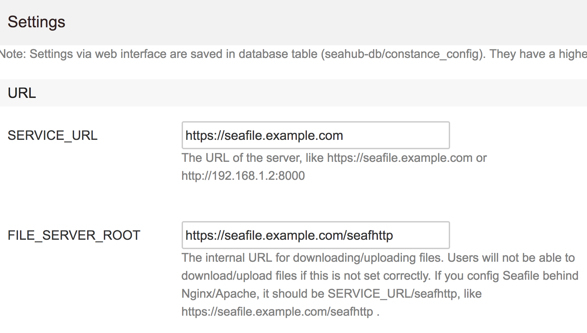

[Seafile](https://www.seafile.com) Docker container based on Ubuntu
originating from [here](https://github.com/m3adow/dockerfiles)

[](https://hub.docker.com/r/gronis/seafile/)
[](https://hub.docker.com/r/gronis/seafile/)
[](https://hub.docker.com/r/gronis/seafile/)
[](https://microbadger.com/images/gronis/seafile)
[](https://microbadger.com/images/gronis/seafile)

### Features

* Comes with the newest seafile version at rebuild
* Automatically runs upgrade scripts (when recreating docker image) provided by seafile
* Automatically run seafile garbage collector (when recreating docker image)
* Configurable to run with MySQL/MariaDB or SQLite
* Auto-setup at initial run

### Overview

Filetree:
```
/seafile/
|-- ccnet
|-- conf
|-- seafile-data
`-- seahub-data
/opt/
`-- haiwen
    |-- ccnet -> /seafile/ccnet
    |-- conf -> /seafile/conf
    |-- logs
    |-- pids
    |-- seafile-data -> /seafile/seafile-data
    |-- seafile-server-5.1.3
    |-- seafile-server-latest -> seafile-server-5.1.3
    `-- seahub-data -> /seafile/seahub-data
```

All important data is stored under /seafile, so you should be mounting a volume there (recommended), as shown in the example configurations, or at the respective subdirectories.
There are a plethora of environment variables which might be needed for your setup.

**Mandatory ENV variables for auto setup**

* **SEAFILE_NAME**: Name of your Seafile installation
* **SEAFILE_ADDRESS**: URL to your Seafile installation
* **SEAFILE_ADMIN**: E-mail address of the Seafile admin
* **SEAFILE_ADMIN_PW**: Password of the Seafile admin

If you want to use MySQL/MariaDB, the following variables are needed:

**Mandatory ENV variables for MySQL/MariaDB**

* **MYSQL_SERVER**: Address of your MySQL server
* **MYSQL_USER**: MySQL user Seafile should use
* **MYSQL_USER_PASSWORD**: Password for said MySQL User
*Optionali:*
* **MYSQL_PORT**: Port MySQL runs on

**Optional ENV variables for auto setup with MySQL/MariaDB**
* **MYSQL_USER_HOST**: Host the MySQL User is allowed from (default: '%')
* **MYSQL_ROOT_PASSWORD**: If you haven't set up the MySQL tables by yourself, Seafile will do it for you when being provided with the MySQL root password

If you plan on omitting /seafile as a volume and mount the subdirectories instead, you'll need to additionally specify `SEAHUB_DB_DIR` which containes the subdirectory of /seafile the *seahub.db* file shall be put in.

There are some more variables which could be changed but have not been tested and are probably not fully functional as well. Therefore those not mentioned here. Inspect the `seafile-entrypoint.sh` script if you have additional needs for customization.

### Example configurations

#### Using `docker-run`
If you want to run with sqlite:
```bash
docker run -d -e SEAFILE_NAME=Seafile \
	-e SEAFILE_ADDRESS=seafile.example.com \
	-e SEAFILE_ADMIN=admin@seafile.example.com \
	-e SEAFILE_ADMIN_PW=SuperSecretPassword \
	-v /host/os/path:/seafile \
  gronis/seafile
```
If you want to use MySQL:
```bash
docker run -d -e SEAFILE_NAME=Seafile \
	-e SEAFILE_ADDRESS=seafile.example.com \
	-e SEAFILE_ADMIN=admin@seafile.example.com \
	-e SEAFILE_ADMIN_PW=SuperSecretPassword \
  -e MYSQL_SERVER=seafile-db \
  -e MYSQL_USER=seafile \
  -e MYSQL_USER_PASSWORD=SuperSecretDatabasePassword \
  -e MYSQL_ROOT_PASSWORD=EvenMoreSuperSecretDatabasePassword \
	-v /host/os/path:/seafile \
  gronis/seafile
```

#### Using `docker-compose`
With sqlite
```yaml
version: '2'
services:
  seafile:
    image: gronis/seafile
    container_name: seafile
    restart: unless-stopped
    volumes:
      - ./seafile-container-data:/seafile:rw
    ports:
      - 8000:8000
      - 8082:8082
    environment:
      - SEAFILE_NAME=Seafile
      - SEAFILE_ADDRESS=seafile.example.com
      - SEAFILE_ADMIN=admin@seafile.example.com
      - SEAFILE_ADMIN_PW=SuperSecretPassword
```

With MySQL
```yaml
version: '2'
services:
  seafile:
    image: gronis/seafile
    container_name: seafile
    restart: unless-stopped
    depends_on:
      - seafile-db
    links:
      - seafile-db
    volumes:
      - ./seafile-container-data:/seafile:rw
    ports:
      - 8000:8000
      - 8082:8082
    environment:
      - SEAFILE_NAME=Seafile
      - SEAFILE_ADDRESS=seafile.example.com
      - SEAFILE_ADMIN=admin@seafile.example.com
      - SEAFILE_ADMIN_PW=SuperSecretPassword
      - MYSQL_SERVER=seafile-db
      - MYSQL_USER=seafile
      - MYSQL_USER_PASSWORD=SuperSecretDatabasePassword
      - MYSQL_ROOT_PASSWORD=EvenMoreSuperSecretDatabasePassword

  seafile-db:
    image: wangxian/alpine-mysql:latest
    container_name: seafile-db
    restart: unless-stopped
    volumes:
      - ./seafile-db-data:/app
      - ./seafile-db-lock:/run/mysqld
    environment:
      - MYSQL_ROOT_PASSWORD=EvenMoreSuperSecretDatabasePassword
```

### Complete HTTPS Web server
This container is intended to be run behind a reverse proxy. You can read more about that in the Seafile manual: http://manual.seafile.com/deploy/

I'll recommend to use nginx reverse proxy with automated updating process with letsencrypt. This requires you to own the domain you are using. Here is a full example, using MySQL and together with nginx reverse proxy, assuming the domain name is `seafile.example.com`

NOTE: Use [nginx.tmpl](https://github.com/jwilder/nginx-proxy/blob/master/nginx.tmpl) to generate the nginx config. Here, I assume the domain name `seafile.example.com` but switch it out for your own domain.

```yaml
version: '2'
services:
  seafile:
    image: gronis/seafile
    container_name: seafile
    restart: unless-stopped
    depends_on:
      - seafile-db
    links:
      - seafile-db
    volumes:
      - ./seafile-container-data:/seafile:rw
    environment:
      - VIRTUAL_HOST=seafile.example.com
      - VIRTUAL_PORT=8000
      - LETSENCRYPT_HOST=seafile.example.com
      - LETSENCRYPT_EMAIL=youremail@youremailprovider.com
      - SEAFILE_NAME=Seafile
      - SEAFILE_ADDRESS=seafile.example.com
      - SEAFILE_ADMIN=admin@seafile.example.com
      - SEAFILE_ADMIN_PW=SuperSecretPassword
      - MYSQL_SERVER=seafile-db
      - MYSQL_USER=seafile
      - MYSQL_USER_PASSWORD=SuperSecretDatabasePassword
      - MYSQL_ROOT_PASSWORD=EvenMoreSuperSecretDatabasePassword

  seafile-db:
    image: wangxian/alpine-mysql:latest
    container_name: seafile-db
    restart: unless-stopped
    volumes:
      - ./seafile-db-data:/app
      - ./seafile-db-lock:/run/mysqld
    environment:
      - MYSQL_ROOT_PASSWORD=EvenMoreSuperSecretDatabasePassword

  # Network traffic passes through nginx (as https) and then to seafile (as http)
  nginx:
    image: nginx:alpine
    container_name: nginx
    restart: always
    ports:
      - 80:80
      - 443:443
    volumes:
      - ./nginx/conf.d:/etc/nginx/conf.d:ro
      - ./nginx/vhost.d:/etc/nginx/vhost.d:ro
      - ./nginx/html:/usr/share/nginx/html
      - ./nginx/certs:/etc/nginx/certs:ro
      - ./nginx/htpasswd:/etc/nginx/htpasswd:ro

  # This container generate the nginx configuration
  nginx-gen:
    image: jwilder/docker-gen:0.7.3
    container_name: nginx-gen
    restart: always
    depends_on:
      - nginx
    volumes_from:
      - nginx
    volumes:
      - /var/run/docker.sock:/tmp/docker.sock:ro
      - ./nginx.tmpl:/etc/docker-gen/templates/nginx.tmpl:ro
      - ./nginx/conf.d:/etc/nginx/conf.d:rw
    networks:
      - proxy-tier
    entrypoint: /usr/local/bin/docker-gen -notify-sighup nginx -watch -wait 5s:30s /etc/docker-gen/templates/nginx.tmpl /etc/nginx/conf.d/default.conf

  # This container refreshes the https certificate
  letsencrypt-nginx-proxy-companion:
    image: jrcs/letsencrypt-nginx-proxy-companion:v1.4
    container_name: letsencrypt-nginx-proxy-companion
    restart: unless-stopped
    depends_on:
      - nginx
      - nginx-gen
    volumes_from:
      - nginx
    volumes:
      - /var/run/docker.sock:/var/run/docker.sock:ro
      - ./nginx/vhost.d:/etc/nginx/vhost.d:rw
      - ./nginx/certs:/etc/nginx/certs:rw
    environment:
      - NGINX_DOCKER_GEN_CONTAINER=nginx-gen

```
Since Seafile uses port 8082 to sync files, this extra config must be added to nginx to enable passthrough over the nginx proxy using https.
This configuration file should be placed in `/etc/nginx/vhost.d/seafile.example.com` on nginx-gen (`./nginx/vhost.d` from the above config), to enable port 8082 to pass though the domain.
It will automatically be embedded into `/etc/nginx/conf/default.conf` on the nginx server (see more [here](https://github.com/jwilder/nginx-proxy)).
```conf
location /seafhttp {
    rewrite               ^/seafhttp(.*)$ $1 break;
    proxy_pass            http://seafile:8082;
    client_max_body_size  0;
    proxy_connect_timeout 36000s;
    proxy_read_timeout    36000s;
    proxy_send_timeout    36000s;
    send_timeout          36000s;
}
```
To make sure that the proxy is used to sync files instead of using port 8082, Go to admin settings page: `https://seafile.example.com/sys/settings/` and change `SERVICE_URL` and `FILE_SERVER_ROOT` according to this image:



### Other
If you want to run seahub in fastcgi mode, you can pass ENV variables **SEAFILE_FASTCGI=1** and **SEAFILE_FASTCGI_HOST=0.0.0.0**
